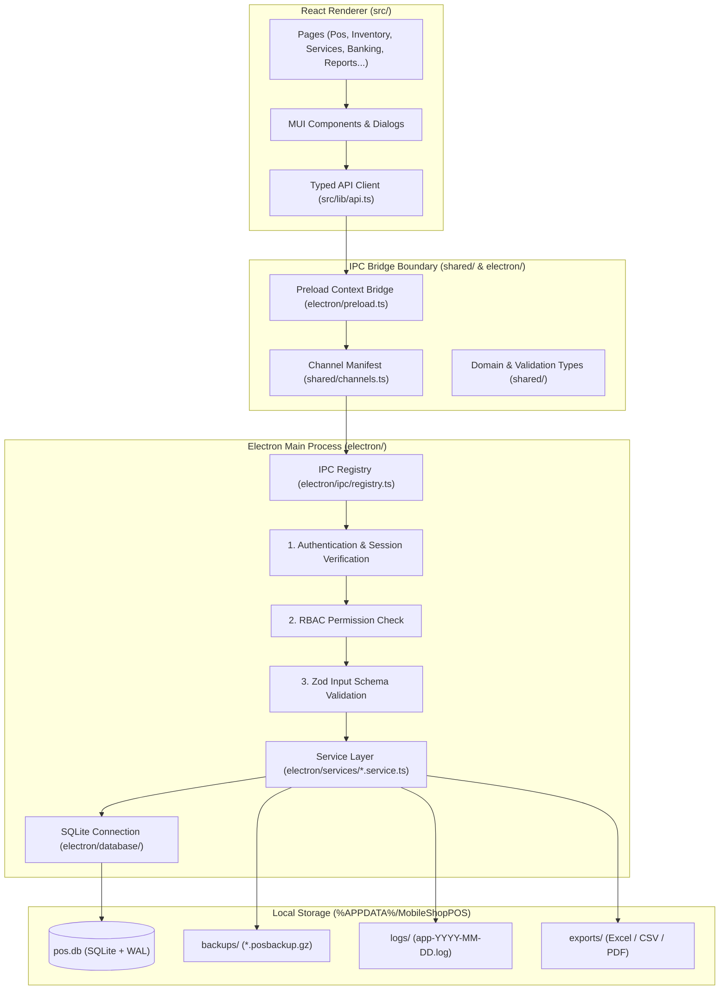

# 🗺️ Project Map & Architecture Guide: Green Mobile POS

> **Purpose of this document:**  
> This file is a comprehensive technical map of the **Green Mobile POS** codebase. It is designed to allow new developers and AI agents to quickly understand the project's architecture, patterns, conventions, directory layout, and development workflows.

---

## 1. Project Overview & System Philosophy

**Green Mobile POS** is an offline-first Windows desktop Point of Sale (POS), inventory management, and repair service tracking system tailored for mobile phone sales, accessories retail, and repair workshops.

### Core Architectural Principles
1. **100% Offline & Self-Contained:** Everything runs locally on the PC. Zero cloud dependencies, zero external APIs, zero online licensing or remote authentication.
2. **Synchronous & ACID Database:** Powered by `better-sqlite3` for fast, zero-latency synchronous transactional queries with WAL (Write-Ahead Logging) enabled.
3. **Prisma as Schema-Only (Build-Time):** `prisma/schema.prisma` is the single declarative source of truth for the database schema. Prisma Client is **not** shipped to runtime to avoid query engine binary overhead and native packaging hurdles. Migrations are executed at runtime as numbered SQL delta scripts.
4. **Strict Minor-Unit Money (No Floats):** All financial amounts are stored as integers representing the smallest currency unit (e.g. `31000` = `310.00`). Tax/discount rates are integers in basis points (`700` = `7.00%`).
5. **Type-Safe, Validated IPC Boundary:** Renderer input is **never** trusted. Every IPC call passes through a centralized registry with Zod validation, session authentication, and RBAC permission checks before hitting service handlers.

---

## 2. Technology Stack

| Layer | Technologies |
|---|---|
| **Desktop Shell** | Electron 43, Node.js |
| **Frontend UI** | React 19, TypeScript, Vite 8, Material UI (MUI 9), Emotion, React Router 7 |
| **State & Data Fetching** | TanStack Query v5, React Hook Form, Zod |
| **Data Visualization** | Recharts |
| **Local Database** | SQLite via `better-sqlite3` (with WAL mode, foreign keys enabled) |
| **Schema Definition** | Prisma 7 (Build-time SQL generator) |
| **Cryptography / Auth** | `bcryptjs` (work factor 12) |
| **Reporting / Export** | `exceljs`, CSV generation, Chromium offscreen PDF printing |
| **Testing** | Vitest (in-memory & file SQLite integration tests), custom smoke test bridge |
| **Packaging / Installer** | `electron-builder` (NSIS installer for 64-bit Windows) |

---

## 3. High-Level Architecture & Data Flow



---

## 4. Directory Structure Map

```
green-mobile/
├── electron/                   # Electron Main process & backend logic
│   ├── database/               # Database initialization, SQLite connection, migration runner, seeds
│   │   ├── connection.ts       # better-sqlite3 singleton, WAL pragmas, integrity checks
│   │   ├── index.ts            # Database bootstrapper and lifecycle
│   │   ├── migrator.ts         # SQL migration runner & automatic schema versioning
│   │   └── seed.ts             # Initial master data / test seeds
│   ├── ipc/                    # IPC channel definitions and handlers
│   │   ├── registry.ts         # Central security, permission, validation & error barrier
│   │   ├── auth.ipc.ts         # Login, logout, session status, password changes
│   │   ├── catalog.ipc.ts      # Products, brands, categories
│   │   ├── sales.ipc.ts        # POS checkout, sales history, cancellations, refunds
│   │   ├── services.ipc.ts     # Repair orders, parts, labor, status transitions
│   │   ├── banking.ipc.ts      # Bank accounts, transfers, cash drawer counts
│   │   ├── expenses.ipc.ts     # Shop expense entries & categories
│   │   ├── reports.ipc.ts      # Financial, inventory, service, P&L reports
│   │   ├── backup.ipc.ts       # Manual & automatic backup/restore
│   │   ├── settings.ipc.ts     # Shop preferences, receipts, currency settings
│   │   └── users.ipc.ts        # User management & role assignment
│   ├── services/               # Core business logic layer
│   │   ├── audit.service.ts    # Immutable audit logging
│   │   ├── auth.service.ts     # Password hashing & verification, tokenless session
│   │   ├── backup.service.ts   # Gzip database backup, integrity check, restore
│   │   ├── banking.service.ts  # Bank ledger & cash count reconciliations
│   │   ├── customer.service.ts # Customer CRM & purchase history
│   │   ├── document.service.ts # Receipt & invoice generation HTML templates
│   │   ├── expense.service.ts  # Expense tracking & categories
│   │   ├── export.service.ts   # Excel (.xlsx) / CSV exporters
│   │   ├── import.service.ts   # Product batch import with preview & validation
│   │   ├── inventory.service.ts# Stock adjustment, IMEI/serial tracking, ledger
│   │   ├── print.service.ts    # Thermal & A4 printing via offscreen Electron windows
│   │   ├── product.service.ts  # Product catalog, barcodes, pricing
│   │   ├── report.service.ts   # Report aggregations (Sales, P&L, Inventory, Tax)
│   │   ├── sale.service.ts     # POS transactional checkout, refunds, receipts
│   │   ├── sequence.service.ts # Atomic sequential document numbering (INV-0001, etc.)
│   │   ├── service.service.ts  # Repair workflow, status machine, parts billing
│   │   ├── settings.service.ts # Key-value shop configuration store
│   │   └── user.service.ts     # User CRUD & authorization
│   ├── utils/                  # Paths, logger, ID generator (UUIDv4)
│   ├── bootstrap.ts            # App startup orchestration, integrity error handling
│   ├── main.ts                 # Electron app lifecycle & window management
│   ├── preload.ts              # Secure contextBridge exposing window.api
│   ├── security.ts             # WebPreferences, CSP, window navigation locks
│   └── session.ts              # In-memory session store & permission resolver
│
├── prisma/                     # Database Schema & Migrations (Build-time)
│   ├── schema.prisma           # Single source of truth for DB schema
│   └── migrations/             # Numbered SQL migration directories (0001, 0002...)
│
├── shared/                     # Cross-boundary shared code (used by Main and UI)
│   ├── api.ts                  # Complete IPC interface contracts (Renderer <-> Main)
│   ├── backup.ts               # Backup metadata interfaces
│   ├── channels.ts             # Strongly typed IPC channel string constants
│   ├── datetime.ts             # Date and time formatting utilities
│   ├── domain.ts               # Core domain types, enums, roles & permissions
│   ├── errors.ts               # AppError classes, error codes, IPC response wrappers
│   ├── import.ts               # Batch import types and preview models
│   ├── money.ts                # Integer minor-unit arithmetic, tax, currency formatters
│   ├── report.ts               # Report structures, filter types, export formats
│   ├── settings.ts             # Shop settings schema & defaults
│   └── validation.ts           # Zod schemas for every payload traversing IPC
│
├── src/                        # React Frontend (Vite)
│   ├── assets/                 # Static assets and icons
│   ├── components/             # Reusable UI components & dialogs
│   │   ├── charts/             # Recharts wrappers & theme definitions
│   │   ├── MoneyField.tsx      # Form input for minor-unit currency amounts
│   │   ├── ProductDialog.tsx   # Add/Edit product modal
│   │   ├── PaymentDialog.tsx   # POS multi-tender payment popup
│   │   ├── SaleDetailDialog.tsx# Sale inspection, receipt preview, refund trigger
│   │   ├── ServiceIntakeDialog # New repair order intake form
│   │   └── ...                 # Additional entity dialogs
│   ├── hooks/                  # Custom React hooks (useAuth, useSettings, useDebounced)
│   ├── layouts/                # AppLayout, sidebar navigation, top bar, status indicators
│   ├── lib/                    # api.ts (frontend wrapper around window.api)
│   ├── pages/                  # Top-level route pages
│   │   ├── PosPage.tsx         # Fast barcode/search POS checkout terminal
│   │   ├── ProductsPage.tsx    # Catalog & master data management
│   │   ├── InventoryPage.tsx   # Stock levels, ledger, IMEI serials, adjustments
│   │   ├── SalesPage.tsx       # Historical transactions, filtering, refunds
│   │   ├── ServicesPage.tsx    # Mobile repair order tracking & workflow
│   │   ├── BankingPage.tsx     # Bank accounts, transfers, cash drawer counts
│   │   ├── ExpensesPage.tsx    # Operational expense tracking
│   │   ├── CustomersPage.tsx   # Customer directory & purchase history
│   │   ├── ReportsPage.tsx     # Interactive analytics & report exports
│   │   ├── DashboardPage.tsx   # KPIs, charts, recent sales, low stock alerts
│   │   ├── UsersPage.tsx       # User management & role assignment
│   │   ├── SettingsPage.tsx    # Shop, tax, receipt, and document configuration
│   │   ├── BackupPanel.tsx     # Backup creation, restore, schedule status
│   │   ├── LoginPage.tsx       # Authentication screen
│   │   └── FirstRunWizard.tsx  # Initial shop admin setup wizard
│   ├── theme/                  # MUI theme setup (colors, typography, components)
│   ├── App.tsx                 # Root router and auth context boundary
│   └── main.tsx                # React DOM entry point
│
├── scripts/                    # Build, migration, smoke test & utility scripts
│   ├── build-electron.mjs      # esbuild script for main process & preload
│   ├── dev.mjs                 # Dual-watch Vite + Electron dev runner
│   ├── generate-migration-sql  # Generates initial SQL from schema.prisma
│   ├── smoke.mjs               # End-to-end headless verification test runner
│   └── screenshot.mjs          # Headless automated documentation screenshot tool
│
└── tests/                      # Vitest test suite
    ├── helpers/                # Test database factories and fixture builders
    ├── auth.test.ts            # Authentication & session tests
    ├── sales.test.ts           # POS transactions, calculations, refund tests
    ├── inventory.test.ts       # Stock ledger and serial number tests
    ├── banking.test.ts         # Banking transfers and cash count tests
    ├── services.test.ts        # Repair order lifecycle tests
    ├── security.test.ts        # IPC channel access & permission tests
    └── ...                     # Comprehensive service unit tests
```

---

## 5. Domain Rules & Core Invariants

### 1. Money & Calculation Invariants
* **Never use floating-point numbers for money.**
* All money values in the database, IPC payloads, and business logic are integers representing minor units (`100` = `1.00 USD/MMK/etc.`).
* Tax rates and discount percentages are integers stored in **basis points** (`100 bps` = `1.00%`, `750 bps` = `7.50%`).
* Currency math utilities reside in [shared/money.ts](file:///c:/Users/user/Documents/me/green%20mobile/shared/money.ts). Always use functions like `calculateItemTotal`, `calculateCartTotals`, and `formatMoney`.

### 2. Time & Date Conventions
* **UTC Instants:** Stored as ISO-8601 strings (e.g. `2026-08-21T02:20:45.123Z`). Used for `createdAt`, `updatedAt`, audit log ordering, and timestamps.
* **Business Days:** Stored as local `YYYY-MM-DD` strings (e.g. `2026-08-21`). Calculated based on local PC time at write time. All financial reports group by business days to prevent timezone/DST calculation drift.

### 3. Primary Keys & IDs
* All entity IDs are generated using `crypto.randomUUID()` (UUID v4 strings). Auto-increment integer IDs are avoided to ensure conflict-free multi-terminal or cloud synchronization if added in the future.

### 4. Financial Records Immutability
* Sales, payments, stock ledger entries, and audit logs are **never hard-deleted**.
* Cancellations and refunds create compensating records (`SaleReturn`, `InventoryTransaction` adjustments) preserving the full audit trail.

### 5. Role-Based Access Control (RBAC)
* **Roles:** `ADMIN`, `MANAGER`, `CASHIER`.
* Defined in [shared/domain.ts](file:///c:/Users/user/Documents/me/green%20mobile/shared/domain.ts).
* Permissions are evaluated in [electron/session.ts](file:///c:/Users/user/Documents/me/green%20mobile/electron/session.ts) and enforced declaratively at the IPC registry level in [electron/ipc/registry.ts](file:///c:/Users/user/Documents/me/green%20mobile/electron/ipc/registry.ts).

---

## 6. IPC Bridge & Security Architecture

The IPC layer connects the frontend renderer to Node.js / SQLite backend:

1. **Preload Layer (`electron/preload.ts`):** Exposes `window.api` using Electron `contextBridge`. Only known channel names defined in [shared/channels.ts](file:///c:/Users/user/Documents/me/green%20mobile/shared/channels.ts) can be invoked.
2. **IPC Registry (`electron/ipc/registry.ts`):**
   ```typescript
   handle(
     CHANNELS.SALES_CREATE,
     { access: 'permission', permission: 'sales.create' },
     createSaleSchema,
     (payload, ctx) => saleService.createSale(payload, ctx.user)
   );
   ```
   * **Authentication Guard:** Automatically validates active session user.
   * **Permission Guard:** Checks if user's role has the designated permission.
   * **Zod Validation:** Validates and coerces payload against Zod schema before calling service.
   * **Sanitized Errors:** Catch-all converts unexpected exceptions to clean error codes while logging details locally.
3. **Renderer API Client (`src/lib/api.ts`):** Unwraps `{ ok: true, data }` responses or throws typed `AppError`.

---

## 7. Database Migrations Workflow

1. `prisma/schema.prisma` is modified to represent schema changes.
2. New migrations are created as sequential folders under `prisma/migrations/` (e.g. `0005_feature_name/migration.sql`).
3. During development of initial schema: `npm run schema:sql` generates migration SQL using Prisma engine.
4. On startup, [electron/database/migrator.ts](file:///c:/Users/user/Documents/me/green%20mobile/electron/database/migrator.ts) automatically checks `_prisma_migrations` in SQLite and applies pending migrations inside a transaction. An automatic safety backup is taken prior to any migration.

---

## 8. Essential Developer Commands

| Command | Action |
|---|---|
| `npm run dev` | Launches Vite dev server + Electron with hot reload |
| `npm run build` | Compiles frontend (Vite) and Electron backend (esbuild) |
| `npm run typecheck` | Runs TypeScript checks for both Electron and React codebases |
| `npm test` | Runs the full Vitest automated test suite |
| `npm test:watch` | Runs Vitest in interactive watch mode |
| `npm run smoke` | Runs end-to-end smoke tests against a temporary SQLite instance |
| `npm run screenshot` | Automatically captures screenshots of all screens into `screenshots/` |
| `npm run dist` | Builds production 64-bit Windows installer `.exe` |
| `npm run dist:dir` | Builds unpacked Windows production executable (faster test build) |

---

## 9. Guide for Adding New Features

When adding or modifying features in this codebase, follow this pattern:

1. **Define Types & Validation (`shared/`):**
   - Add domain interfaces in `shared/domain.ts` or `shared/api.ts`.
   - Define Zod input validation schema in `shared/validation.ts`.
   - Add IPC channel constant in `shared/channels.ts`.
2. **Implement Business Logic (`electron/services/`):**
   - Write SQLite queries using `better-sqlite3` prepared statements inside transactions.
   - Respect integer minor-unit money and UTC/business day formats.
   - Record relevant audit log entries via `auditService.log(...)`.
3. **Register IPC Handler (`electron/ipc/`):**
   - Register channel in the appropriate `*.ipc.ts` file with required permission and Zod schema.
4. **Expose in Frontend API Client (`src/lib/api.ts`):**
   - Add typed helper method calling `invoke(CHANNELS.YOUR_CHANNEL, input)`.
5. **Build UI (`src/pages/` & `src/components/`):**
   - Use TanStack Query (`useQuery` / `useMutation`) for caching and automated invalidation.
   - Use MUI components and `MoneyField` for money inputs.
6. **Add Automated Tests (`tests/`):**
   - Add unit/integration test in `tests/` using test DB helpers.
   - Run `npm test` and `npm run typecheck` to verify zero regressions.
